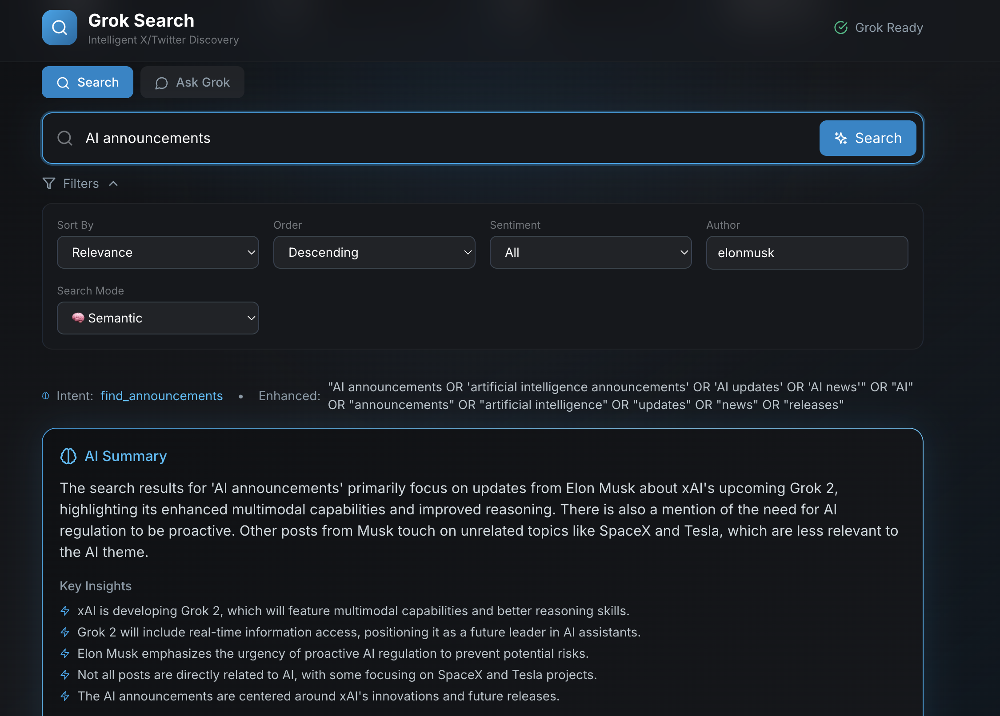
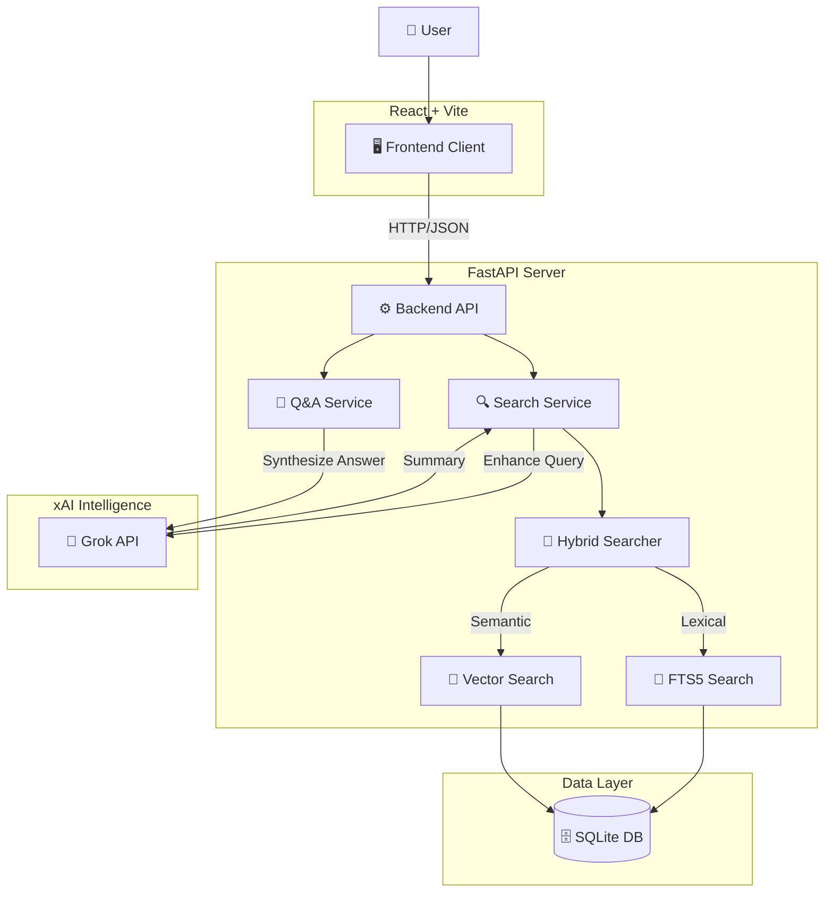

# 🔍 Grok Search

**Intelligent X/Twitter Search Powered by Grok AI**

A full-stack search system that leverages xAI's Grok API to provide intelligent discovery and retrieval of X/Twitter posts. Built for the xAI Technical Assessment.




> **Watch the Demo:**
> 
> 

---

## 🎯 Key Features

| Feature | Description | Status |
|---------|-------------|--------|
| **Grok API Integration** | Query enhancement, content analysis, summarization | ✅ |
| **Token-Based Search** | FTS5 full-text search with boolean operators | ✅ |
| **Semantic Search** | 128-dim embedding vectors with hybrid retrieval | ✅ |
| **AI Summarization** | Context-aware summaries of search results | ✅ |
| **Question Answering** | Natural language Q&A over posts | ✅ |
| **Real-time UI** | Auto-refreshing filters, responsive design | ✅ |

---

## ✨ Feature Details

### 🧠 Grok API Integration
- **Query Enhancement**: Grok analyzes and improves search queries
- **Intent Recognition**: Understands user intent (find_opinions, find_news, find_announcements, etc.)
- **Query Expansion**: Automatically expands queries with related terms and synonyms
- **Content Analysis**: Generates descriptions, topics, sentiment, and entities for each post
- **Error Handling**: Retry logic with exponential backoff for API resilience

### 🔎 Token-Based Retrieval (Required)
- **SQLite FTS5**: High-performance full-text search engine
- **Boolean Operators**: Support for AND, OR queries with phrase matching
- **Multi-field Search**: Searches content, descriptions, topics, and author
- **Filters**: Author, sentiment, date range, engagement metrics
- **Fast Indexing**: Automatic triggers maintain search index on insert/update/delete

### 🧬 Embedding-Based Retrieval (Optional - Implemented!)
- **Vector Embeddings**: 128-dimensional hash-based embeddings for each post
- **Cosine Similarity**: Semantic matching based on meaning, not just keywords
- **Hybrid Mode**: Combines FTS5 keyword search + vector similarity for best results
- **Three Search Modes**: 
  - `keyword` - Traditional full-text search
  - `semantic` - Embedding-based similarity search  
  - `hybrid` - Weighted combination of both (default)

### 💬 Intelligent Query Processing
- **Ambiguous Query Detection**: Identifies vague queries and asks for clarification
- **Query Reformulation**: Expands "AI" to "artificial intelligence, machine learning, deep learning"
- **Intent Classification**: Categorizes queries by type (opinions, news, announcements, etc.)

### 📊 AI Summarization
- **Search Summaries**: Grok generates contextual summaries of search results
- **Key Insights**: Highlights most important findings
- **Thematic Analysis**: Groups results by theme
- **Suggested Queries**: Recommends related searches

### 🖥️ Frontend Interface
- **Real-time Search**: Results appear as you type (with debounce)
- **Auto-refresh Filters**: Changing filters automatically updates results
- **Search Mode Toggle**: Switch between keyword/semantic/hybrid
- **Sort Options**: By relevance, likes, retweets, date
- **Sentiment Filter**: Filter by positive/negative/neutral/mixed
- **Responsive Design**: Works on desktop and mobile

---

## 🚀 Quick Start

### Prerequisites
- Docker and Docker Compose
- Grok API Key from [console.x.ai](https://console.x.ai)

### 1. Clone & Configure

```bash
git clone https://github.com/yourusername/grok-search.git
cd grok-search

# Create environment file
echo "XAI_API_KEY=your_api_key_here" > .env
```

### 2. Run with Docker

```bash
# Build and start
docker-compose up --build

# The app will be available at http://localhost:8000
```

### 3. Load Sample Data

```bash
# Via API
curl -X POST http://localhost:8000/api/scrape -H "Content-Type: application/json" -d '{"load_sample": true}'

# Or click "Load Sample Posts" in the UI
```

---

## 🛠️ Local Development

### Backend Setup

```bash
cd backend

# Create virtual environment
python -m venv venv
source venv/bin/activate  # Windows: venv\Scripts\activate

# Install dependencies
pip install -r requirements.txt

# Set environment variable
export XAI_API_KEY=your_api_key_here

# Run the server
uvicorn app.main:app --reload --port 8000
```

### Frontend Setup

```bash
cd frontend

# Install dependencies
npm install

# Run dev server (proxies to backend on :8000)
npm run dev
```

Visit http://localhost:3000 for frontend with hot reload.

---

## 📡 API Reference

### Search Endpoints

#### GET /api/search
Simple search with query parameters.

```bash
# Basic search
curl "http://localhost:8000/api/search?q=AI+technology"

# With filters
curl "http://localhost:8000/api/search?q=startup+advice&author=naval&sentiment=positive&mode=hybrid"
```

**Parameters:**
| Parameter | Type | Default | Description |
|-----------|------|---------|-------------|
| `q` | string | required | Search query |
| `limit` | int | 20 | Max results (1-100) |
| `offset` | int | 0 | Pagination offset |
| `sort_by` | string | "relevance" | Sort: relevance, likes, retweets, posted_at |
| `sort_order` | string | "desc" | Order: asc, desc |
| `author` | string | null | Filter by author username |
| `sentiment` | string | null | Filter: positive, negative, neutral, mixed |
| `mode` | string | "hybrid" | Search mode: keyword, semantic, hybrid |
| `include_summary` | bool | true | Include AI summary |
| `enhance_query` | bool | true | Use Grok to enhance query |

#### POST /api/search
Complex search with JSON body (same parameters as above).

```bash
curl -X POST http://localhost:8000/api/search \
  -H "Content-Type: application/json" \
  -d '{"query": "What are tech leaders saying about AGI?", "mode": "hybrid"}'
```

### Question Answering

#### POST /api/ask
Ask natural language questions about the posts.

```bash
curl -X POST http://localhost:8000/api/ask \
  -H "Content-Type: application/json" \
  -d '{"question": "What do leaders think about AI safety?"}'
```

**Response:**
```json
{
  "answer": "Tech leaders express varied views on AI safety...",
  "sources": [...],
  "query_analysis": {...}
}
```

### Data Management

#### POST /api/scrape
Load sample data or scrape accounts.

```bash
# Load 100 sample posts
curl -X POST http://localhost:8000/api/scrape \
  -H "Content-Type: application/json" \
  -d '{"load_sample": true}'

# Scrape specific account (uses Nitter)
curl -X POST http://localhost:8000/api/scrape \
  -H "Content-Type: application/json" \
  -d '{"username": "elonmusk"}'
```

#### GET /api/posts
List posts with pagination and filters.

```bash
curl "http://localhost:8000/api/posts?limit=50&author=sama"
```

#### POST /api/posts
Add a custom post.

```bash
curl -X POST http://localhost:8000/api/posts \
  -H "Content-Type: application/json" \
  -d '{"post_id": "custom_1", "author_username": "user", "content": "Post content"}'
```

### Utilities

#### GET /api/stats
Database statistics.

```bash
curl http://localhost:8000/api/stats
```

**Response:**
```json
{
  "total_posts": 100,
  "unique_authors": 20,
  "posts_with_embeddings": 100,
  "top_authors": [...]
}
```

#### GET /api/health
System health check.

```bash
curl http://localhost:8000/api/health
```

---

## 🏗️ Architecture



### Simplified Flow

```
+----------------+        +----------------+
|    Frontend    |        |    Grok API    |
| (React + Vite) | <----> |     (xAI)      |
+----------------+        +----------------+
        |                         ^
        | HTTP Request            | Query Enhancement
        v                         | Summarization
+----------------+        +----------------+
|    Backend     |------->| Search Service |
|   (FastAPI)    |        | (Hybrid Logic) |
+----------------+        +----------------+
        |                         |
        | SQL / FTS5 Query        | Vector Similarity
        v                         v
+----------------+        +----------------+
|    Database    |        |   Embeddings   |
| (SQLite + FTS) |        |  (Hash/Vector) |
+----------------+        +----------------+
```

---

## 📁 Project Structure

```
grok-search/
├── backend/
│   ├── app/
│   │   ├── main.py          # FastAPI app initialization
│   │   ├── config.py        # Settings (env vars)
│   │   ├── database.py      # SQLAlchemy models & FTS5
│   │   ├── grok_client.py   # Grok API wrapper
│   │   ├── search.py        # Search service (FTS5 + vectors)
│   │   ├── scraper.py       # Data collection
│   │   ├── embeddings.py    # Local embedding generator
│   │   ├── schemas.py       # Pydantic request/response models
│   │   └── routes.py        # API endpoints
│   ├── data/
│   │   └── sample_posts.json  # 100 sample posts
│   └── requirements.txt
├── frontend/
│   ├── src/
│   │   ├── App.tsx          # Main React component
│   │   ├── api.ts           # API client functions
│   │   ├── types.ts         # TypeScript types
│   │   └── index.css        # Tailwind styles
│   ├── package.json
│   └── vite.config.ts
├── Dockerfile
├── docker-compose.yml
└── README.md
```

---

## 🔑 Environment Variables

| Variable | Description | Required | Default |
|----------|-------------|----------|---------|
| `XAI_API_KEY` | Your Grok API key from console.x.ai | **Yes** | - |
| `DATABASE_URL` | SQLite database path | No | `./grok_search.db` |
| `DEBUG` | Enable debug logging | No | `true` |
| `HOST` | Server host | No | `0.0.0.0` |
| `PORT` | Server port | No | `8000` |
| `SCRAPE_DELAY_SECONDS` | Delay between scrape requests | No | `2.0` |

---

## 🎯 Example Queries

### Search Queries
```
"AI announcements from tech leaders"
"startup advice" author:naval
"machine learning developments" sentiment:positive
"what's new in AI" mode:semantic
```

### Questions to Ask (via /api/ask)
```
"What are people saying about AGI?"
"What startup advice do founders share?"
"What AI tools are being announced?"
"How do tech leaders view AI safety?"
```

---

## 🔧 Troubleshooting

### Common Issues

| Issue | Solution |
|-------|----------|
| "Grok Not Configured" | Ensure `XAI_API_KEY` is set correctly |
| Empty search results | Load sample data first: POST /api/scrape `{"load_sample": true}` |
| Slow searches | Disable AI features: `enhance_query=false&include_summary=false` |
| Rate limiting | Wait a moment, the app has retry logic with backoff |
| Docker build fails | Ensure Docker has 4GB+ memory allocated |
| Port 8000 in use | Change port in docker-compose.yml |

### API Rate Limits

- Each search makes 2-3 Grok API calls (query enhancement, summarization)
- Question answering makes 1-2 calls
- To reduce API usage: `enhance_query=false` or `include_summary=false`

---

## 📊 Technical Specifications

| Component | Technology | Details |
|-----------|------------|---------|
| **Backend** | FastAPI 0.109 | Async Python, auto-docs at /docs |
| **Database** | SQLite + FTS5 | Full-text search, ACID compliant |
| **Embeddings** | 128-dim hash vectors | Deterministic, no external API needed |
| **Frontend** | React 18 + Vite | TypeScript, Tailwind CSS |
| **AI** | Grok API (xAI) | Query enhancement, summarization |
| **Container** | Docker + Compose | Single-command deployment |

---

## 📄 License

MIT License - see LICENSE file for details.

## 🙏 Acknowledgments

- Built with [Grok](https://x.ai) by xAI
- FastAPI for the excellent web framework
- React + Vite for the frontend
- Tailwind CSS for styling
